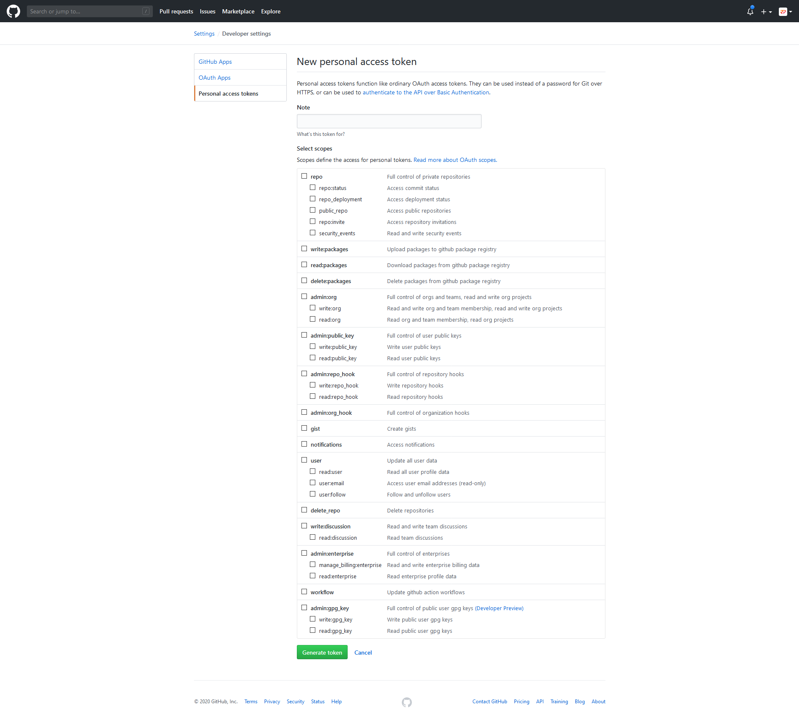
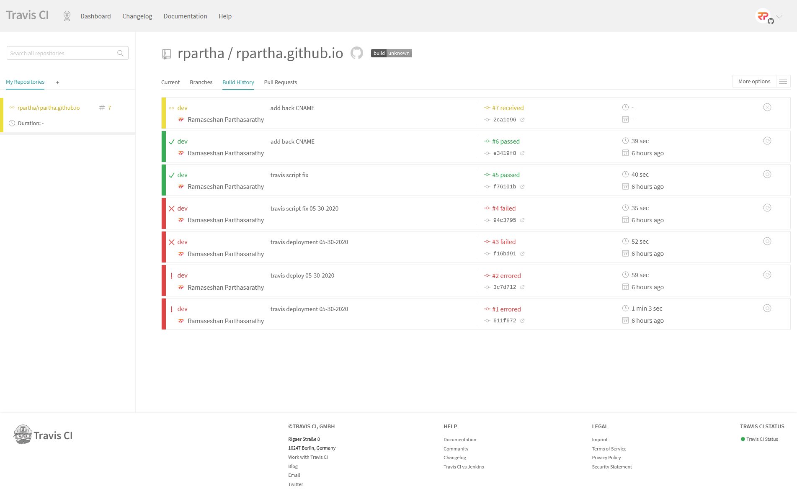
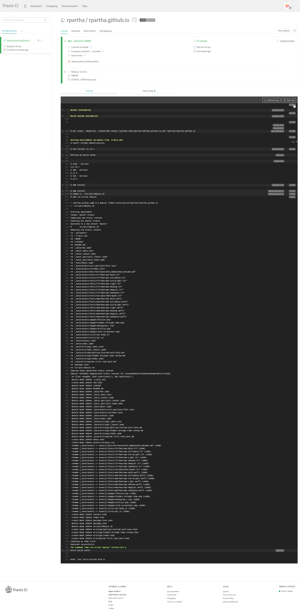

# Auto-Deploy Harp.js Blogs with Travis CI

Having written this blog using Harp.js, I wanted to automate the process of deploying it to the target branch as doing it manually was quite cumbersome. That's where <a href="https://travis-ci.org" target='_blank' rel='noopener noreferrer'>Travis CI</a>, a hosted continuous integration service that works with Github, came into play. Assuming you already have a blog setup, stick around to find out exactly how to automatically deploy your blog to the target branch. 

## Create a Github Token

First thing's first, you're going to need a new personal access token since you'll be interacting with Github via a script and will need to let Github know on who's behalf the script is acting. 

To do that, head over to **Settings**, and then **Developer settings**, and then **Personal access tokens**, and finally click on **Generate new token**. You should see the below screen:  



Give the token an appropriate description in the **Note** text field and select only the **repo**, **admin:repo_hook**, and **user** scopes. Remember to save the token after generating it as you won't be able to retrieve it after the fact and will instead have to regenerate a new one.

## Getting Started with Travis CI

Now that you have a Github token to identify yourself, it's time to setup Travis:

1. Head to <a href="https://travis-ci.org" target='_blank' rel='noopener noreferrer'>https://travis-ci.org</a> and sign-up with your Github account. It's FREE for **open-source** repositories.
2. Click on your profile picture in the top right of your Travis Dashboard, click **Settings** and then the green **Activate** button, and select the repositories you want to use with Travis CI. 


Enabling the repository only notifies Travis that new code has been submittted, but we still need to tell it what to do with the code. For that we need to create a `.travis.yml` file in the root of the build branch (the branch we intend on building— in my case, `dev`) to allow Travis to check for further instructions. Below is the `.travis.yml` file for this blog, though you may or may  not need certain commands. Let's break this down further. 

```yml
# development language
language: node_js

# language version
node_js: ['12.16.1']

# prior to script execution
before_script:
  - npm install
  - chmod +x ./scripts/deploy.sh

# execute the script
script:
  - npm run-script deploy

# build notifications
notifications:
  email:
    on_success: always
    on_failure: always
    recipients:
      - example@gmail.com

# branch or branches to build
branches:
  only:
    - dev
```

### Node.js 

First, we tell Travis to instantiate a Node.js environment using the specified version. 

### Pre-Deployment

Next, we list out the commands that Travis should execute <ins>before</ins> the `script` commands get executed. Therefore, if any of these commands fail to execute for whatever reason, the build will not continue and the `script` commands will not execute. 

### Deployment Script

Next, the `script` command will execute the deployment script. This script will take care of compiling the app and pushing the static content to the repo. Below is the script I used to deploy this blog:

```bash
#!/bin/bash
echo "Starting deployment"
echo "Target: master branch"

TEMP_DIRECTORY="/tmp/deploy"
CURRENT_COMMIT=`git rev-parse HEAD`
ORIGIN_URL=`git config --get remote.origin.url`
ORIGIN_URL_WITH_CREDENTIALS=${ORIGIN_URL/\/\/github.com/\/\/$GITHUB_TOKEN@github.com}

echo "Compiling new static content"
mkdir $TEMP_DIRECTORY || exit 1
harp compile your-blog $TEMP_DIRECTORY || exit 1
cp .gitignore $TEMP_DIRECTORY || exit 1
cp CNAME $TEMP_DIRECTORY || exit 1

echo "Checking out master branch"
git checkout -b master || exit 1

echo "Removing old static content"
git rm -rf . || exit 1

echo "Copying newly generated static content"
cp -r $TEMP_DIRECTORY/* . || exit 1
cp $TEMP_DIRECTORY/.gitignore . || exit 1
cp $TEMP_DIRECTORY/CNAME . || exit 1

git add -A . || exit 1
git commit --allow-empty -m "Regenerated static content for $CURRENT_COMMIT" || exit 1
git push --force --quiet "$ORIGIN_URL_WITH_CREDENTIALS" master > /dev/null 2>&1

echo "Cleaning up temp files"
rm -Rf $TEMP_DIRECTORY

echo "Deployed successfully."
exit 0
```

The above script basically boils down to the following steps:

1. Extract the git information that we will need later on to push the changes back to Github.
2. Compile the static app to a temp directory. Copy the `.gitignore` and `CNAME` files to restore them later on.
3. Check out the target branch, remove its existing files, and restore the generated content from the temp directory.
4. Finally, commit and push everything to the target branch, and clean up the temp files. 

### Build Notifications

We can also optionally specify who wants to receive certain build notifications and what notifcations are to be received.

### Build Branches

After that, we need to specify which branch or branches need to be built. 

### Environment Variables

Last but not least, we have the ability to define environment variables to customize the build process. Travis allows us to take it a step further by allowing us to encrypt these variables to prevent sensitive information from being seen by anyone who views this file. In order to add encrypted variables to your `.travis.yml` file, you must have <a href="https://www.ruby-lang.org/en/downloads/" target='_blank' rel='noopener noreferrer'>Ruby</a> installed and execute the below commands in a terminal:

```bash
$ gem install travis
$ cd your_project
$ travis encrypt GITHUB_TOKEN=your-secret-github-token --add
```

You should now see the below added to your `.travis.yml` file:

```yml
# environment variables
env:
  global:
    secure: <encrypted string>
```

Travis will actually decrypt the encrypted string to use as a regular environment variable when executing your script, making it easy to access the original `GITHUB_TOKEN`. 

## Initiating a Build

Now it's time to see everything in action. To trigger a build, we need to push an update to the build branch (depends on your workflow). You should now see a yellow build appear at the top of the list in Travis. 



You can view more details and a live log by clicking on the build. If the build was successful, it would be marked as passed (green), otherwise it would be marked as failing (red). The logs in Travis should indicate what, if anything, went wrong. 



The nice thing about Travis is that your live blog is only updated when all commands run successfull. If anything were to fail, the deployment would not go through.

## Closing Remarks

We've only scratched the surface in terms what Travis can do. I highly suggest reading its documentation to find even more customized ways to automate many facets of your project. Hopefully you found this article useful, even if don't use Harp.js or host your site on Github. Have a good one!