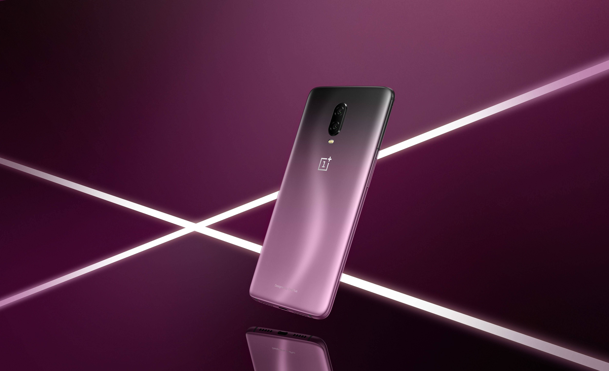

# OnePlus 6T Revisited: Two Years Later!

The OnePlus 6T had a LOT going for it at the time. It was one of the first phones from OnePlus to follow OnePlus' 
third iteration of their design language, which included a metal-glass sandwich design, an elegant waterdrop cutout 
that was easy on the eyes, and even an in-display fingerprint sensor. The seamless frosted-back design paved way for 
the gorgeous Thunder Purple option pictured above. On top of that, it became the first OnePlus phone to offer 128 GB 
as a standard storage option.

With that said, performance is one of the top priorties for OnePlus, so it comes as no surprise that a 
two-year-old phone still runs just as well as did as when I first bought it. The OnePlus 6T has been outfitted with a 
Snapdragon 845 chipset, LPDDR4X RAM, and UFS 2.1 storage. Sure it isn't as fast and fluid as modern day hardware, but it's 
by no means a no slouch either, making the OnePlus 6T a pleasure to use in 2020. And the vibrant 2340 x 1080 AMOLED display 
also holds quite nicely, even if it doesn't offer a high refresh rate.  

Hardware isn't the only area of expertise for OnePlus phones, though. OnePlus' OxygenOS has generally been well regarded since 
it takes everything that Android has to offer and tacks on an abundance of customization options in addition to niche features 
such as Zen Mode, built-in screen recording, and superior volume controls that most other phones simply don't provide. Software
plays a huge part in smartphone longevity, so we expect no less from OxygenOS, which is doing its part wonderfully. 

Not all is well as the 6T does show its age in key areas— notably in the camera and display departments. The 6T features a 16MP 
main camera and a 20MP secondary sensor at the back, coupled with a 16MP shooter up front. It becomes quite clear how unremarkable
this camera system is in 2020. The 6T's camera does perform fairly decent during the daytime and well-lit conditions, but really
tends to struggle with lowlight conditions. I personally recommend getting a <a href="https://www.celsoazevedo.com/files/android/google-camera/" target='_blank' rel='noopener noreferrer'>GCAM port for your device</a> if you want improved image quality. Google's magical software image processing does a lot
of the heavy lifting. For around the same price, phones these days can get you much better image quality due to higher-res sensors 
and lense versatility (though the Pixel 5 with its three-year-old sensor still manages to take exceptionally good photos that rival 
top players).

As far as the display is concerned, the difference between screens with standard 60 Hz refresh rates and those with higher 
90+ Hz refresh rates is apparantly night-and-day. In fact, you won't be able truely appreciate high refresh displays
until you go back to using a display with standard refresh rate. I can't vouch for that myself as I haven't used a 
phone with a high refresh display yet, but if this is something that you really care about, then absolutely go for it. For most
people, it shouldn't make _that_ much of a difference.

All in all, the OnePlus 6T has aged very well in the past two years. It's reliable in day-to-day use largely in thanks to its powerful 
hardware and extremely well-optimized UI, and even gets regular updates. It may not have the best display or the best camera, but for 
what I use the phone for, it isn't really a deal-breaker for me. Frankly, I see no reason to upgrade to a new device this year as the 
6T still runs like a champ. OnePlus really outdid themselves and the competition by making a strong entrance into the world of premium 
smartphones.