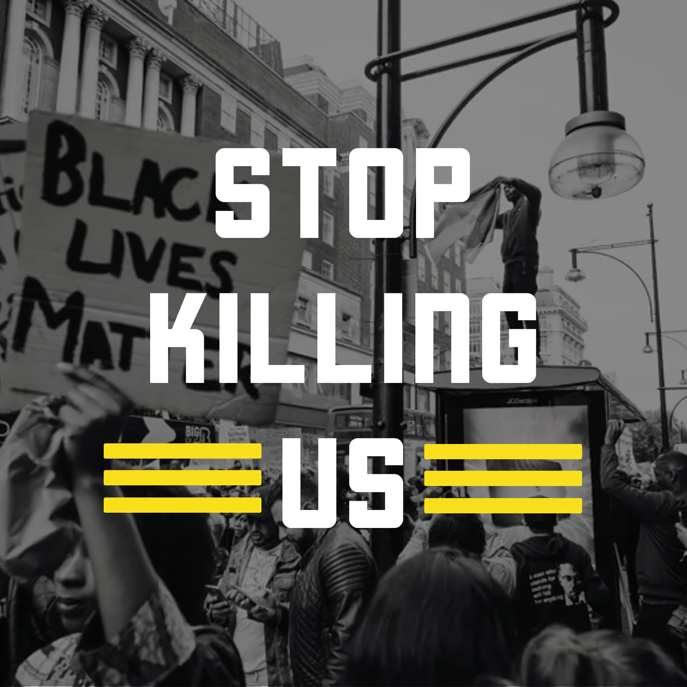

# Thoughts About George Floyd and the Protests

In light of recent events — mainly the MURDER of George Floyd and the protests that followed and are ongoing at the time of writing this post— I wanted to share my opinions on the matter. If you've seen the video, then you'd know that the way in which he was killed was truly horrific and honestly should've never happened (if you feel otherwise, please get the fuck off my blog). And if, for instance, the evidence had shown that the perpetrator was an average civilian, then the arrest would have happened almost immediately. Despite what had occured and the evidence to back it up being readily available, he was not arrested until after the protesting had begun because _he was a police officer_. As it stands right now, at the time of writing this post, the remaining three officers involved have NOT yet been taken into custody. I, along with several others, believe that these three officers should, with 100% certainty, be taken into custody and be prosecuted so that we can get justice for this. Obviously this is not an isolated event. Not too long ago, there a man was accosted and killed by two white men with shotguns for merely jogging in the neighborhood. That's all he was doing. He was black and he was jogging. While these events are fairly recent, you don't have to look back much further to find other such incidents. 

So now the protests that are taking place in cities accross the country are the people's way of saying that (1) justice needs to be served to all police officers invovled in the George Floyd murder and (2) changes need to made to police protocol regarding how they should act on civilians— the black and minorities in particular— since they are more likely to be treated harshly if they get pulled over or are asked to appear in front of a judge as a defendant. The fact that no arrests were made until that point is pretty telling. Protesting is a great start to making a change happen if done peacefully. However, that does not grant the right to opportunists to take advantage of the situation and hurt businesses. These are very much two separate crowds. Although it is nice to see footage of people handing over rowdy protestors over to the police, you simply can't ignore the other footage showing how the police is acting with the crowd. That's a telltale sign that reform **needs** to happen within the ranks. For example, tear gas was fired at people for being on their porches past curfew, someone's mask was pulled down to pepper-spray him, and someone else lost an eye thanks to the rubber bullets. This kind of behavior is quite uncessary for protestors who don't pose an immediate threat, which the aforementioned examples certainly didn't. 

One of the things you can and probably should be doing is documenting this kind of stuff on social media and online platforms, which thankfully many people have already been doing and have been very good about. It's important to make sure that this stuff is seen and that your voice is heard. Below are other ways to get involved and make a contribution:

* <a href='../assets/images/solidarity-march.png' target="_blank" rel="noopener noreferrer">Black Lives Matter Solidarity March</a> (For those of you that live near Plainsboro, NJ— it's this Saturday, 1PM at HSN)
* <a href="https://www.aclu.org/issues/criminal-law-reform/reforming-police/aclu-apps-record-police-conduct" target='_blank' rel='noopener noreferrer'>ACLU Apps to Record Police Conduct</a> (The evidence will remain intact on their server even if your phone is destroyed)
* <a href="https://action.aclu.org/give/now" target='_blank' rel='noopener noreferrer'>Donate to The ACLU</a> (The work they do is important and you get to support a good cause)
* <a href="https://www.gofundme.com/f/georgefloyd" target='_blank' rel='noopener noreferrer'>GoFundMe for George Floyd's Family</a> (Directly support his family— they deserve all they can get)
* <a href="https://www.gofundme.com/f/peoples-city-council-ticket-fund" target='_blank' rel='noopener noreferrer'>People's City Council Freedom Fund</a> (Donate in other ways)

Last thing I want to say before I forget is to make sure to **register to vote**. I was guilty of it myself during the 2016 election and have since became a registered voter. Don't just stop there— vote in people who have taken notice of this situation, have vowed to make changes, and have a proven track record of fighting against racism, discrimination, police brutality, etc. These are the people we **need** in office, and your vote matters a lot, especially if you live in a battleground or swing state. 

That's all I have to say. But I will leave you with this— imagine your son or daughter growing up in a world where people discriminate him/her and treat him/her with prejudices. That's so incredibly fucked up. It would be difficult to explain this to him/her years down the line when they're older. Considering it's 2020, the level of racism that still prevails is honestly mind-blowing. And for the folks that are protesting, please stay safe. 